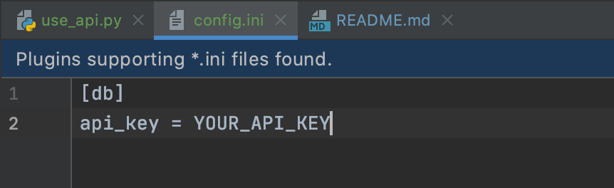

# Homework 07

## Part 1 Queries

#####1. DESCRIBE your tables(s)
describe courses;

``` 
MariaDB [mzv205_courses_nyu]> describe courses;
+---------------+-------------+------+-----+---------+-------+
| Field         | Type        | Null | Key | Default | Extra |
+---------------+-------------+------+-----+---------+-------+
| course_number | varchar(45) | NO   | PRI | NULL    |       |
| semester      | varchar(45) | NO   | PRI | NULL    |       |
| alt_req       | varchar(45) | YES  |     | NULL    |       |
| course_name   | varchar(45) | YES  |     | NULL    |       |
| level         | varchar(45) | YES  |     | NULL    |       |
| professor     | varchar(45) | YES  |     | NULL    |       |
| meet_time     | varchar(45) | YES  |     | NULL    |       |
| room          | varchar(45) | YES  |     | NULL    |       |
| description   | varchar(45) | YES  |     | NULL    |       |
+---------------+-------------+------+-----+---------+-------+
```

#####2. show the first few rows
select * from courses limit 10;

``` 
MariaDB [mzv205_courses_nyu]> select * from courses limit 10;
+-------------------+------------+------------+-----------------------------------+-------+---------------------+---------------+------------------+-----------------------------------------------+
| course_number     | semester   | alt_req    | course_name                       | level | professor           | meet_time     | room             | description                                   |
+-------------------+------------+------------+-----------------------------------+-------+---------------------+---------------+------------------+-----------------------------------------------+
| CSCI-GA.1133-?001 | FALL2020   | NULL       | PAC I*                            | GA    | Evan Korth          | T 6:30-9:00PM | ONLINE           | An accelerated introduction to the fundamenta |
| CSCI-GA.1133-?002 | FALL2020   | NULL       | PAC I Recitation                  | GA    | Nolan Filter        | W 6:10-7:00PM | ONLINE           | An accelerated introduction to the fundamenta |
| CSCI-GA.1133-?003 | FALL2020   | NULL       | PAC I Recitation                  | GA    | CANCELLED           |  -            | NULL             | An accelerated introduction to the fundamenta |
| CSCI-GA.1144-?001 | SPRING2020 | NULL       | PAC II*                           | GA    | Mohamed Zahran      | T 6:00-8:30PM | CIWW 312         | This course builds directly on the foundation |
| CSCI-GA.1144-?002 | SPRING2020 | NULL       | PAC II Recitation                 | GA    | Rutviben Malaviya   | R 7:10-8:00PM | CIWW 312         | This course builds directly on the foundation |
| CSCI-GA.1170-?001 | FALL2020   | DS-GA.1170 | Fundamental Algorithms            | GA    | Richard  Cole       | T 5:10-7:00PM | ONLINE           | Reviews a number of important algorithms, wit |
| CSCI-GA.1170-?001 | SPRING2020 | DS-GA.1170 | Fundamental Algorithms            | GA    | Chee Yap            | M 5:10-7:00PM | 60 Fifth Ave 110 | Reviews a number of important algorithms, wit |
| CSCI-GA.1170-?002 | FALL2020   | DS-GA.1170 | Fundamental Algorithms Recitation | GA    | Harish Karthikeyan  | R 5:10-6:00PM | CIWW 109         | Reviews a number of important algorithms, wit |
| CSCI-GA.1170-?002 | SPRING2020 | DS-GA.1170 | Fundamental Algorithms Recitation | GA    | Abhinav Tamaskar    | W 5:10-6:00PM | CIWW 101         | Reviews a number of important algorithms, wit |
| CSCI-GA.1170-?003 | FALL2020   | DS-GA.1170 | Fundamental Algorithms            | GA    | Alexander Alekseyev | W 5:10-7:00PM | ONLINE           | Reviews a number of important algorithms, wit |
+-------------------+------------+------------+-----------------------------------+-------+---------------------+---------------+------------------+-----------------------------------------------+

```

#####3. Query 1: Query to check the courses that fulfill any other requirement other than CS
UPDATE courses
set alt_req = NULL
where alt_req = 'NULL';

select * from courses where alt_req is not NULL;
``` 
MariaDB [mzv205_courses_nyu]> select * from courses where alt_req is not NULL;
+-------------------+------------+----------------+-----------------------------------------------+-------+----------------------+------------------+-------------------+-----------------------------------------------+
| course_number     | semester   | alt_req        | course_name                                   | level | professor            | meet_time        | room              | description                                   |
+-------------------+------------+----------------+-----------------------------------------------+-------+----------------------+------------------+-------------------+-----------------------------------------------+
| CSCI-GA.1170-?001 | FALL2020   | DS-GA.1170     | Fundamental Algorithms                        | GA    | Richard  Cole        | T 5:10-7:00PM    | ONLINE            | Reviews a number of important algorithms, wit |
| CSCI-GA.1170-?001 | SPRING2020 | DS-GA.1170     | Fundamental Algorithms                        | GA    | Chee Yap             | M 5:10-7:00PM    | 60 Fifth Ave 110  | Reviews a number of important algorithms, wit |
| CSCI-GA.1170-?002 | FALL2020   | DS-GA.1170     | Fundamental Algorithms Recitation             | GA    | Harish Karthikeyan   | R 5:10-6:00PM    | CIWW 109          | Reviews a number of important algorithms, wit |
| CSCI-GA.1170-?002 | SPRING2020 | DS-GA.1170     | Fundamental Algorithms Recitation             | GA    | Abhinav Tamaskar     | W 5:10-6:00PM    | CIWW 101          | Reviews a number of important algorithms, wit |
| CSCI-GA.1170-?003 | FALL2020   | DS-GA.1170     | Fundamental Algorithms                        | GA    | Alexander Alekseyev  | W 5:10-7:00PM    | ONLINE            | Reviews a number of important algorithms, wit |
| CSCI-GA.1170-?003 | SPRING2020 | DS-GA.1170     | Fundamental Algorithms                        | GA    | Yevgeniy Dodis       | T 7:10-9:00PM    | CIWW 109          | Reviews a number of important algorithms, wit |
| CSCI-GA.1170-?004 | FALL2020   | DS-GA.1170     | Fundamental Algorithms Recitation             | GA    | Agnitha Mohan Ram    | F 6:10-7:00PM    | ONLINE            | Reviews a number of important algorithms, wit |
| CSCI-GA.1170-?004 | SPRING2020 | DS-GA.1170     | Fundamental Algorithms Recitation             | GA    | Harish Karthikeyan   | R 8:10-9:00PM    | CIWW 109          | Reviews a number of important algorithms, wit |
| CSCI-GA.1170-?005 | FALL2020   | DS-GA.1170     | Fundamental Algorithms Recitation             | GA    | Srikar Varadaraj     | R 5:10-6:00PM    | ONLINE            | Reviews a number of important algorithms, wit |
| CSCI-GA.1170-?006 | FALL2020   | DS-GA.1170     | Fundamental Algorithms Recitation             | GA    | Fengyuan Liu         | F 7:10-8:00PM    | ONLINE            | Reviews a number of important algorithms, wit |
| CSCI-GA.1170-?007 | FALL2020   | DS-GA.1170     | Fundamental Algorithms Recitation             | GA    | CANCELLED            |  -               | NULL              | Reviews a number of important algorithms, wit |
| CSCI-GA.1170-?011 | FALL2020   | DS-GA.1170     | Fundamental Algorithms                        | GA    | Chee Yap             | M 5:45-7:35PM    | 1555 Century 201  | Reviews a number of important algorithms, wit |
| CSCI-GA.1170-?012 | FALL2020   | DS-GA.1170     | Fundamental Algorithms Recitation             | GA    | Chee Yap             | T 5:10-6:00PM    | 1555 Century 1505 | Reviews a number of important algorithms, wit |
| CSCI-GA.2433-?001 | FALL2020   | DS-GA.2433-001 | Database Systems                              | GA    | Zvi Kedem            | M 5:10-7:00PM    | ONLINE            | Database system architecture. Modeling an app |
| CSCI-GA.2433-?001 | SPRING2020 | DS-GA.2433-001 | Database Systems                              | GA    | Zvi Kedem            | W 5:10-7:00PM    | CIWW 109          | Database system architecture. Modeling an app |
| CSCI-GA.2433-?011 | FALL2020   | DS-GA.2433-001 | Database Systems                              | GA    | Xiaoyang Sean Wang   | R 3:15-5:05PM    | 1555 Century 210  | Database system architecture. Modeling an app |
| CSCI-GA.2572-?001 | SPRING2020 | DS-GA.1008-001 | Deep Learning                                 | GA    | Yann LeCun           | M 4:55-6:35PM    | GCASL C95         | This course concerns the latest techniques in |
| CSCI-GA.2572-?002 | SPRING2020 | DS-GA.1008-002 | Deep Learning Lab                             | GA    | Alfredo Canziani     | T 7:10-8:00PM    | GCASL C95         | This course concerns the latest techniques in |
| CSCI-GA.2945-?001 | FALL2020   | MATH-GA        | Advanced Topics In Numerical Methods: Monte C | GA    | Jonathan Goodman     | W 5:10-7:00PM    | CIWW 1302         | Topics vary each semester.                    |
| CSCI-GA.2945-?002 | FALL2020   | MATH-GA        | Advanced Topics In Numerical Analysis: Numeri | GA    | CANCELLED            |  -               | NULL              | Topics vary each semester.                    |
| CSCI-GA.3033-?020 | SPRING2020 | DS-GA.3033-014 | Special Topics: Mathematics of Deep Learning  | GA    | Joan Bruna           | R 5:10-7:00PM    | CIWW 201          | This graduate-level course explores some of t |
| CSCI-GA.3033-?083 | FALL2020   | DS-GA.3001-005 | Special Topics in Data Science: Machine Learn | GA    | Rajesh Ranganath     | M 2:00-3:40PM    | HEBU CR1          | The course covers machine learning methods im |
| CSCI-GA.3033-?087 | FALL2020   | DS-GA.3001-011 | Special Topics in Data Science: Bayesian Mach | GA    | Andrew Gordon Wilson | W 5:00-6:40PM    | HEBU CR1          | This course aims to provide students with a s |
| CSCI-GA.3033-?091 | FALL2020   | DS-GA.3001-006 | Special Topics in Data Science: Machine Learn | GA    | Aalad Manas Puli     | T 1:00-1:50PM    | Silv 405          | The course covers machine learning methods im |
| CSCI-GA.3033-?092 | FALL2020   | DS-GA.3001-012 | Special Topics in Data Science: Bayesian Mach | GA    | Pavel Izmailov       | M 7:00-7:50PM    | Silv 405          | This course aims to provide students with a s |
| CSCI-UA.0330-?001 | SPRING2020 | MATH-UA.0144   | Introduction to Computer Simulation           | UA    | Charles  Peskin      | TR 11:00-12:15PM | CIWW 317          | In this course, students will learn how to do |
+-------------------+------------+----------------+-----------------------------------------------+-------+----------------------+------------------+-------------------+-----------------------------------------------+

```
#####4.Query 2: Query to check all the classes that take place on Wednesdays
select * from courses where meet_time like '%W%';

``` 
MariaDB [mzv205_courses_nyu]> select * from courses where meet_time like '%W%';
+-------------------+------------+----------------+-----------------------------------------------+-------+------------------------------+------------------+------------------+-----------------------------------------------+
| course_number     | semester   | alt_req        | course_name                                   | level | professor                    | meet_time        | room             | description                                   |
+-------------------+------------+----------------+-----------------------------------------------+-------+------------------------------+------------------+------------------+-----------------------------------------------+
| CSCI-GA.1133-?002 | FALL2020   | NULL           | PAC I Recitation                              | GA    | Nolan Filter                 | W 6:10-7:00PM    | ONLINE           | An accelerated introduction to the fundamenta |
| CSCI-GA.1170-?002 | SPRING2020 | DS-GA.1170     | Fundamental Algorithms Recitation             | GA    | Abhinav Tamaskar             | W 5:10-6:00PM    | CIWW 101         | Reviews a number of important algorithms, wit |
| CSCI-GA.1170-?003 | FALL2020   | DS-GA.1170     | Fundamental Algorithms                        | GA    | Alexander Alekseyev          | W 5:10-7:00PM    | ONLINE           | Reviews a number of important algorithms, wit |
| CSCI-GA.2110-?001 | FALL2020   | NULL           | Programming Languages                         | GA    | Benjamin Goldberg            | W 5:10-7:00PM    | ONLINE           | Discusses the design, use, and implementation |
| CSCI-GA.2110-?011 | FALL2020   | NULL           | Programming Languages                         | GA    | Yuxin Deng                   | W 5:10-7:00PM    | 16 Qi Xia 917    | Discusses the design, use, and implementation |
| CSCI-GA.2250-?002 | SPRING2020 | NULL           | Operating Systems                             | GA    | Shameem Akhter               | W 7:10-9:00PM    | CIWW 201         | The topics covered include a review of linker |
| CSCI-GA.2433-?001 | SPRING2020 | DS-GA.2433-001 | Database Systems                              | GA    | Zvi Kedem                    | W 5:10-7:00PM    | CIWW 109         | Database system architecture. Modeling an app |
| CSCI-GA.2621-?001 | FALL2020   | NULL           | Distributed Systems                           | GA    | Aurojit Panda                | W 5:10-7:00PM    | ONLINE           | Large-scale distributed systems lie at the co |
| CSCI-GA.2820-?001 | FALL2020   | NULL           | DevOps and Agile Methodologies                | GA    | John Rofrano                 | W 5:10-7:00PM    | ONLINE           | This course uses a project? based learning ap |
| CSCI-GA.2820-?002 | FALL2020   | NULL           | DevOps and Agile Methodologies Lab            | GA    | John Rofrano                 | W 7:10-8:00PM    | ONLINE           | This course uses a project? based learning ap |
| CSCI-GA.2945-?001 | FALL2020   | MATH-GA        | Advanced Topics In Numerical Methods: Monte C | GA    | Jonathan Goodman             | W 5:10-7:00PM    | CIWW 1302        | Topics vary each semester.                    |
| CSCI-GA.3033-?001 | SPRING2020 | NULL           | Special Topics: Big Data Science              | GA    | Anasse Bari                  | W 5:10-7:00PM    | 60 Fifth Ave C15 | Data Science has recently gained a substantia |
| CSCI-GA.3033-?003 | SPRING2020 | NULL           | Special Topics: Production Quality Software   | GA    | Michael Schidlowsky          | W 5:10-7:00PM    | CIWW 317         | In this course we study the craft of software |
| CSCI-GA.3033-?016 | SPRING2020 | NULL           | Special Topics: Multicore Processors: Archite | GA    | Mohamed Zahran               | W 5:10-7:00PM    | CIWW 312         | This is a capstone course.                    |
| CSCI-GA.3033-?023 | SPRING2020 | NULL           | Special Topics: High Performance Machine Lear | GA    | Ulrich Finkler               | W 7:10-9:00PM    | CIWW 312         | This is a capstone course for the MSCS progra |
| CSCI-GA.3033-?024 | SPRING2020 | NULL           | Special Topics: Big Data and ML Systems       | GA    | Lakshminarayanan Subramanian | W 7:10-9:00PM    | CIWW 102         | This class aims to cover introductory and rec |
| CSCI-GA.3033-?025 | FALL2020   | NULL           | Special Topics: Graphics Processing Units (GP | GA    | Mohamed Zahran               | W 5:10-7:00PM    | CIWW 201         | This course serves as a capstone for the MSCS |
| CSCI-GA.3033-?026 | SPRING2020 | NULL           | Special Topics: Practical Computer Security   | GA    | Kevin Chen                   | W 7:10-9:00PM    | CIWW 317         | This course teaches the security mindset and  |
| CSCI-GA.3033-?061 | FALL2020   | NULL           | Special Topics: Predictive Analytics          | GA    | Anasse Bari                  | W 5:10-7:00PM    | CIWW 109         | Predictive analytics is the art and science o |
| CSCI-GA.3033-?084 | FALL2020   | NULL           | Special Topics: High Performance Machine Lear | GA    | Ulrich Finkler               | W 7:10-9:00PM    | ONLINE           | course                                        |
| CSCI-GA.3033-?087 | FALL2020   | DS-GA.3001-011 | Special Topics in Data Science: Bayesian Mach | GA    | Andrew Gordon Wilson         | W 5:00-6:40PM    | HEBU CR1         | This course aims to provide students with a s |
| CSCI-GA.3812-?001 | SPRING2020 | NULL           | Information Technology Projects *             | GA    | Evan Korth                   | W 6:00-9:00PM    | CIWW 512         | This is a capstone course that connects stude |
| CSCI-GA.3850-?007 | SPRING2020 | NULL           | PhD Seminar: Applications of Contextual Integ | GA    | Yan Shvartzshnaider          | W 3:30-4:45PM    | 60 Fifth Ave 446 | Graduate seminars serve as loosely structured |
| CSCI-UA.0002-?001 | SPRING2020 | NULL           | Intro To Computer Programming (No Prior Exper | UA    | Dakota Hernandez             | MW 3:30-4:45PM   | CIWW 201         | An introduction to the fundamentals of comput |
| CSCI-UA.0002-?002 | SPRING2020 | NULL           | Intro To Computer Programming (No Prior Exper | UA    | Craig Kapp                   | MW 9:30-10:45AM  | CIWW 109         | An introduction to the fundamentals of comput |
| CSCI-UA.0002-?003 | FALL2020   | NULL           | Intro To Computer Programming (No Prior Exper | UA    | David Gochfeld               | MW 9:30-10:45AM  | ONLINE           | An introduction to the fundamentals of comput |
| CSCI-UA.0002-?004 | FALL2020   | NULL           | Intro To Computer Programming (No Prior Exper | UA    | Dakota Hernandez             | MW 3:30-4:45PM   | ONLINE           | An introduction to the fundamentals of comput |
| CSCI-UA.0002-?005 | FALL2020   | NULL           | Intro To Computer Programming (No Prior Exper | UA    | Dakota Hernandez             | W 5:00-7:30PM    | ONLINE           | An introduction to the fundamentals of comput |
| CSCI-UA.0002-?006 | SPRING2020 | NULL           | Intro To Computer Programming (No Prior Exper | UA    | David Gochfeld               | MW 9:30-10:45AM  | 60 Fifth Ave C10 | An introduction to the fundamentals of comput |
| CSCI-UA.0002-?007 | FALL2020   | NULL           | Intro To Computer Programming (No Prior Exper | UA    | Na'im Tyson                  | MW 8:00-9:15AM   | ONLINE           | An introduction to the fundamentals of comput |
| CSCI-UA.0002-?008 | FALL2020   | NULL           | Intro To Computer Programming (No Prior Exper | UA    | Craig Kapp                   | MW 12:30-1:45PM  | ONLINE           | An introduction to the fundamentals of comput |
| CSCI-UA.0002-?008 | SPRING2020 | NULL           | Intro To Computer Programming (No Prior Exper | UA    | Adam Meyers                  | MW 8:00-9:15AM   | 60 Fifth Ave C10 | An introduction to the fundamentals of comput |
| CSCI-UA.0002-?011 | FALL2020   | NULL           | Intro To Computer Programming (No Prior Exper | UA    | Adam Meyers                  | MW 2:00-3:15PM   | ONLINE           | An introduction to the fundamentals of comput |
| CSCI-UA.0002-?011 | SPRING2020 | NULL           | Intro To Computer Programming (No Prior Exper | UA    | Na'im Tyson                  | W 6:20-8:50PM    | 60 Fifth Ave C12 | An introduction to the fundamentals of comput |
| CSCI-UA.0002-?012 | SPRING2020 | NULL           | Intro To Computer Programming (No Prior Exper | UA    | Deena Engel                  | MW 2:00-3:15PM   | CIWW 101         | An introduction to the fundamentals of comput |
| CSCI-UA.0003-?001 | FALL2020   | NULL           | Intro to Computer Programming (Limited Prior  | UA    | Joseph Versoza               | MW 9:30-10:45AM  | ONLINE           | This course introduces object-oriented progra |
| CSCI-UA.0004-?001 | SPRING2020 | NULL           | Intro to Web Design & Computer Principles     | UA    | Alvaro Olsen                 | MW 8:00-9:15AM   | 60 Fifth Ave 110 | Introduces students to both the practice of w |
| CSCI-UA.0004-?002 | FALL2020   | NULL           | Intro to Web Design & Computer Principles     | UA    | Alvaro Olsen                 | MW 8:00-9:15AM   | ONLINE           | Introduces students to both the practice of w |
| CSCI-UA.0004-?003 | FALL2020   | NULL           | Intro to Web Design & Computer Principles     | UA    | Lee-Sean Huang               | MW 11:00-12:15PM | ONLINE           | Introduces students to both the practice of w |
| CSCI-UA.0004-?005 | FALL2020   | NULL           | Intro to Web Design & Computer Principles     | UA    | Alvaro Olsen                 | MW 12:30-1:45PM  | ONLINE           | Introduces students to both the practice of w |
| CSCI-UA.0004-?005 | SPRING2020 | NULL           | Intro to Web Design & Computer Principles     | UA    | Lee-Sean Huang               | MW 3:30-4:45PM   | CIWW 101         | Introduces students to both the practice of w |
| CSCI-UA.0004-?006 | FALL2020   | NULL           | Intro to Web Design & Computer Principles     | UA    | Sofya Yuditskaya             | MW 2:00-3:15PM   | ONLINE           | Introduces students to both the practice of w |
| CSCI-UA.0004-?006 | SPRING2020 | NULL           | Intro to Web Design & Computer Principles     | UA    | Lee-Sean Huang               | MW 11:00-12:15PM | CIWW 102         | Introduces students to both the practice of w |
| CSCI-UA.0061-?001 | SPRING2020 | NULL           | Web Development And Programming               | UA    | Craig Kapp                   | MW 12:30-1:45PM  | CIWW 201         | Provides a practical approach to web technolo |
| CSCI-UA.0101-?004 | FALL2020   | NULL           | Intro To Computer Science                     | UA    | Hilbert Gene Locklear        | MW 3:30-4:45PM   | ONLINE           | How to design algorithms to solve problems an |
| CSCI-UA.0101-?004 | SPRING2020 | NULL           | Intro To Computer Science                     | UA    | Hilbert Gene Locklear        | MW 3:30-4:45PM   | CIWW 102         | How to design algorithms to solve problems an |
| CSCI-UA.0101-?005 | FALL2020   | NULL           | Intro To Computer Science                     | UA    | Teseo Schneider              | MW 11:00-12:15PM | ONLINE           | How to design algorithms to solve problems an |
| CSCI-UA.0101-?005 | SPRING2020 | NULL           | Intro To Computer Science                     | UA    | Candido Cabo                 | MW 12:30-1:45PM  | CIWW 202         | How to design algorithms to solve problems an |
| CSCI-UA.0101-?006 | SPRING2020 | NULL           | Intro To Computer Science                     | UA    | Amos Bloomberg               | MW 2:00-3:15PM   | CIWW 317         | How to design algorithms to solve problems an |
| CSCI-UA.0101-?007 | FALL2020   | NULL           | Intro To Computer Science                     | UA    | Candido Cabo                 | MW 12:30-1:45PM  | ONLINE           | How to design algorithms to solve problems an |
| CSCI-UA.0101-?008 | SPRING2020 | NULL           | Intro To Computer Science                     | UA    | Nader Nassar                 | MW 8:00-9:15AM   | CIWW 102         | How to design algorithms to solve problems an |
| CSCI-UA.0102-?001 | SPRING2020 | NULL           | Data Structures                               | UA    | Evan Korth                   | MW 12:30-1:45PM  | 60 Fifth Ave 150 | Use and design of data structures, which orga |
| CSCI-UA.0102-?002 | FALL2020   | NULL           | Data Structures - Recitation                  | UA    | Alankrith Krishnan           | W 8:00-9:15AM    | CIWW 109         | Use and design of data structures, which orga |
| CSCI-UA.0102-?003 | SPRING2020 | NULL           | Data Structures                               | UA    | Young Kun Ko                 | MW 9:30-10:45AM  | CIWW 102         | Use and design of data structures, which orga |
| CSCI-UA.0102-?006 | SPRING2020 | NULL           | Data Structures - Recitation                  | UA    | Alankrith Krishnan           | W 3:30-4:45PM    | Meyr 122         | Use and design of data structures, which orga |
| CSCI-UA.0102-?008 | SPRING2020 | NULL           | Data Structures - Recitation                  | UA    | Abhinav Gupta                | W 8:00-9:15AM    | CIWW 109         | Use and design of data structures, which orga |
| CSCI-UA.0102-?010 | FALL2020   | NULL           | Data Structures - Recitation                  | UA    | Kunal Khatri                 | W 8:00-9:15AM    | ONLINE           | Use and design of data structures, which orga |
| CSCI-UA.0102-?024 | FALL2020   | NULL           | Data Structures - Recitation                  | UA    | Abhinav Gupta                | W 8:00-9:15AM    | ONLINE           | Use and design of data structures, which orga |
| CSCI-UA.0201-?001 | FALL2020   | NULL           | Computer Systems Organization                 | UA    | Douglas Moody                | MW 11:00-12:15PM | ONLINE           | Covers the internal structure of computers, m |
| CSCI-UA.0201-?001 | SPRING2020 | NULL           | Computer Systems Organization                 | UA    | Douglas Moody                | MW 9:30-10:45AM  | CIWW 202         | Covers the internal structure of computers, m |
| CSCI-UA.0201-?005 | FALL2020   | NULL           | Computer Systems Organization                 | UA    | Jean-Claude Franchitti       | MW 3:30-4:45PM   | ONLINE           | Covers the internal structure of computers, m |
| CSCI-UA.0201-?005 | SPRING2020 | NULL           | Computer Systems Organization                 | UA    | Jean-Claude Franchitti       | MW 3:30-4:45PM   | CIWW 109         | Covers the internal structure of computers, m |
| CSCI-UA.0201-?007 | FALL2020   | NULL           | Computer Systems Organization                 | UA    | Jinyang Li                   | MW 12:30-1:45PM  | ONLINE           | Covers the internal structure of computers, m |
| CSCI-UA.0201-?008 | SPRING2020 | NULL           | Computer Systems Organization - Recitation    | UA    | Justin Mae                   | W 3:30-4:45PM    | CIWW 202         | Covers the internal structure of computers, m |
| CSCI-UA.0201-?010 | FALL2020   | NULL           | Computer Systems Organization - Recitation    | UA    | Arahant Ashok Kumar          | W 11:00-12:15PM  | 60 Fifth Ave C15 | Covers the internal structure of computers, m |
| CSCI-UA.0202-?002 | FALL2020   | NULL           | Operating Systems                             | UA    | Mohamed Zahran               | MW 9:30-10:45AM  | ONLINE           | Covers the principles and design of operating |
| CSCI-UA.0202-?002 | SPRING2020 | NULL           | Operating Systems                             | UA    | Yan Shvartzshnaider          | MW 11:00-12:15PM | CIWW 109         | Covers the principles and design of operating |
| CSCI-UA.0310-?002 | FALL2020   | NULL           | Basic Algorithms - Recitation                 | UA    | Alex Bienstock               | W 12:30-1:45PM   | ONLINE           | Introduction to the study of algorithms. Pres |
| CSCI-UA.0310-?003 | FALL2020   | NULL           | Basic Algorithms                              | UA    | Alan  Siegel                 | MW 3:30-4:45PM   | ONLINE           | Introduction to the study of algorithms. Pres |
| CSCI-UA.0310-?003 | SPRING2020 | NULL           | Basic Algorithms                              | UA    | Seyed Nassajianmojarrad      | MW 11:00-12:15PM | CIWW 101         | Introduction to the study of algorithms. Pres |
| CSCI-UA.0310-?006 | SPRING2020 | NULL           | Basic Algorithms - Recitation                 | UA    | Alex Bienstock               | W 12:30-1:45PM   | CIWW 109         | Introduction to the study of algorithms. Pres |
| CSCI-UA.0380-?001 | FALL2020   | NULL           | Topics of General Interest: Interactive Compu | UA    | Craig Kapp                   | MW 9:30-10:45AM  | ONLINE           | In this course you will learn how to develop  |
| CSCI-UA.0473-?001 | FALL2020   | NULL           | Intro To Machine Learning                     | UA    | Benjamin Peherstorfer        | MW 11:00-12:15PM | CIWW 109         | This exciting and fast-evolving field of comp |
| CSCI-UA.0473-?001 | SPRING2020 | NULL           | Intro To Machine Learning                     | UA    | Kyunghyun Cho                | MW 11:00-12:15PM | 60 Fifth Ave 150 | This exciting and fast-evolving field of comp |
| CSCI-UA.0476-?001 | SPRING2020 | NULL           | Processing Big Data for Analytics Application | UA    | Suzanne McIntosh             | MW 4:55-6:10PM   | 7E12 LL23        | Introduces platforms, tools, and architecture |
| CSCI-UA.0480-?002 | SPRING2020 | NULL           | Special Topics: iOS Programming               | UA    | Nathan Hull                  | MW 3:30-4:45PM   | CIWW 317         | Prerequisites: CSCI-UA.0201 with a grade of C |
| CSCI-UA.0480-?003 | SPRING2020 | NULL           | Special Topics: Parallel Computing            | UA    | Mohamed Zahran               | MW 2:00-3:15PM   | CIWW 109         | Prerequisites: CSCI-UA.0201 with a grade of C |
| CSCI-UA.0480-?005 | SPRING2020 | NULL           | Special Topics: Algorithmic Problem Solving - | UA    | Kunal Khatri                 | W 8:00-9:15AM    | CIWW 101         | Many of the top firms in the technological an |
| CSCI-UA.0480-?008 | SPRING2020 | NULL           | Special Topics: Applied Internet Technology   | UA    | Joseph Versoza               | MW 11:00-12:15PM | 12WV L120        | Prerequisites: CSCI-UA.0201 with a grade of C |
| CSCI-UA.0480-?009 | SPRING2020 | NULL           | Special Topics: Natural Language Processing   | UA    | Adam Meyers                  | MW 12:30-1:45PM  | Meyr 122         | Prerequisites:?CSCI-UA.0201 with a grade of C |
| CSCI-UA.0480-?010 | SPRING2020 | NULL           | Special Topics: Open Source Software Developm | UA    | Joanna Klukowska             | MW 3:30-4:45PM   | CIWW 517         | Prerequisites:?CSCI-UA.0201 with a grade of C |
| CSCI-UA.0480-?011 | SPRING2020 | NULL           | Special Topics: Introduction to Computer Secu | UA    | Joseph Bonneau               | MW 12:30-1:45PM  | CIWW 102         | Prerequisites:?CSCI-UA.0201 with a grade of C |
| CSCI-UA.0480-?014 | SPRING2020 | NULL           | Special Topics: iOS Programming               | UA    | Nathan Hull                  | MW 12:30-1:45PM  | CIWW 101         | Detailed course descriptions are available wh |
| CSCI-UA.0480-?034 | FALL2020   | NULL           | Special Topics: Applied Internet Technology   | UA    | Joseph Versoza               | MW 12:30-1:45PM  | ONLINE           | A practical introduction to creating modern w |
| CSCI-UA.0480-?041 | FALL2020   | NULL           | Special Topics: Computer Graphics             | UA    | Kenneth Perlin               | MW 11:00-12:15PM | ONLINE           | There are many courses that can teach you how |
| CSCI-UA.0480-?051 | FALL2020   | NULL           | Special Topics: Parallel Computing            | UA    | Mohamed Zahran               | MW 2:00-3:15PM   | CIWW 109         | Most of us have learned to program a single m |
| CSCI-UA.0480-?062 | FALL2020   | NULL           | Special Topics: Computer Networks             | UA    | Anirudh Sivaraman            | MW 11:00-12:15PM | ONLINE           | This course will introduce students to comput |
| CSCI-UA.0480-?071 | FALL2020   | NULL           | Special Topics: Collaborating Remotely: Build | UA    | Evan Korth                   | MW 12:30-1:45PM  | ONLINE           | In this course students will build software u |
| CSCI-UA.0480-?572 | FALL2020   | NULL           | Special Topics: Natural Language Processing   | UA    | Adam Meyers                  | MW 12:30-1:45PM  | ONLINE           | Natural Language Processing (aka Computationa |
+-------------------+------------+----------------+-----------------------------------------------+-------+------------------------------+------------------+------------------+-----------------------------------------------+

```

## Part 2 Using an API

### Link to API documentation
https://developers.giphy.com/docs/api/endpoint#search

### Request Method and Paths of API URLs Used
HTTP Request Method: GET

Path of API Endpoint = https://api.giphy.com/v1/gifs/search?api_key=&q=&limit=&offset=&rating=&lang=
### Example Format of Response
Format: json
```
{
  "data": [
    {
      "type": "gif",
      "id": "26gson1kP8b8H0ci4",
      "url": "https://giphy.com/gifs/26gson1kP8b8H0ci4",
      "slug": "26gson1kP8b8H0ci4",
      "bitly_gif_url": "http://gph.is/2ko438I",
      "bitly_url": "http://gph.is/2ko438I",
      "embed_url": "https://giphy.com/embed/26gson1kP8b8H0ci4",
      "username": "",
      "source": "",
      "title": "motorcycle GIF",
      "rating": "g",
      "content_url": "",
      "source_tld": "",
      "source_post_url": "",
      "is_sticker": 0,
      "import_datetime": "2017-01-26 15:54:57",
      "trending_datetime": "0000-00-00 00:00:00",
      "images": {
        "original": {
          "height": "478",
          "width": "480",
          "size": "4428742",
          "url": "https://media0.giphy.com/media/26gson1kP8b8H0ci4/giphy.gif?cid=620788f3uu8xisik6rqfpuku5wzhp2w04vndxtwujqkhzmak&rid=giphy.gif",
          "mp4_size": "294274",
          "mp4": "https://media0.giphy.com/media/26gson1kP8b8H0ci4/giphy.mp4?cid=620788f3uu8xisik6rqfpuku5wzhp2w04vndxtwujqkhzmak&rid=giphy.mp4",
          "webp_size": "1155634",
          "webp": "https://media0.giphy.com/media/26gson1kP8b8H0ci4/giphy.webp?cid=620788f3uu8xisik6rqfpuku5wzhp2w04vndxtwujqkhzmak&rid=giphy.webp",
          "frames": "43",
          "hash": "7c5671bcc8e5eb00fee821240f20a11c"
        },
        "downsized": {
          "height": "248",
          "width": "250",
          "size": "1208457",
          "url": "https://media0.giphy.com/media/26gson1kP8b8H0ci4/giphy-downsized.gif?cid=620788f3uu8xisik6rqfpuku5wzhp2w04vndxtwujqkhzmak&rid=giphy-downsized.gif"
        },
        "downsized_large": {
          "height": "478",
          "width": "480",
          "size": "4428742",
          "url": "https://media0.giphy.com/media/26gson1kP8b8H0ci4/giphy.gif?cid=620788f3uu8xisik6rqfpuku5wzhp2w04vndxtwujqkhzmak&rid=giphy.gif"
        },
        "downsized_medium": {
          "height": "478",
          "width": "480",
          "size": "4428742",
          "url": "https://media0.giphy.com/media/26gson1kP8b8H0ci4/giphy.gif?cid=620788f3uu8xisik6rqfpuku5wzhp2w04vndxtwujqkhzmak&rid=giphy.gif"
        },
        "downsized_small": {
          "height": "312",
          "width": "313",
          "mp4_size": "167649",
          "mp4": "https://media0.giphy.com/media/26gson1kP8b8H0ci4/giphy-downsized-small.mp4?cid=620788f3uu8xisik6rqfpuku5wzhp2w04vndxtwujqkhzmak&rid=giphy-downsized-small.mp4"
        },
        "downsized_still": {
          "height": "248",
          "width": "250",
          "size": "24665",
          "url": "https://media0.giphy.com/media/26gson1kP8b8H0ci4/giphy-downsized_s.gif?cid=620788f3uu8xisik6rqfpuku5wzhp2w04vndxtwujqkhzmak&rid=giphy-downsized_s.gif"
        },
        "fixed_height": {
          "height": "200",
          "width": "200",
          "size": "989864",
          "url": "https://media0.giphy.com/media/26gson1kP8b8H0ci4/200.gif?cid=620788f3uu8xisik6rqfpuku5wzhp2w04vndxtwujqkhzmak&rid=200.gif",
          "mp4_size": "72713",
          "mp4": "https://media0.giphy.com/media/26gson1kP8b8H0ci4/200.mp4?cid=620788f3uu8xisik6rqfpuku5wzhp2w04vndxtwujqkhzmak&rid=200.mp4",
          "webp_size": "328804",
          "webp": "https://media0.giphy.com/media/26gson1kP8b8H0ci4/200.webp?cid=620788f3uu8xisik6rqfpuku5wzhp2w04vndxtwujqkhzmak&rid=200.webp"
        },
        "fixed_height_downsampled": {
          "height": "200",
          "width": "200",
          "size": "135293",
          "url": "https://media0.giphy.com/media/26gson1kP8b8H0ci4/200_d.gif?cid=620788f3uu8xisik6rqfpuku5wzhp2w04vndxtwujqkhzmak&rid=200_d.gif",
          "webp_size": "44378",
          "webp": "https://media0.giphy.com/media/26gson1kP8b8H0ci4/200_d.webp?cid=620788f3uu8xisik6rqfpuku5wzhp2w04vndxtwujqkhzmak&rid=200_d.webp"
        },
        "fixed_height_small": {
          "height": "100",
          "width": "100",
          "size": "279063",
          "url": "https://media0.giphy.com/media/26gson1kP8b8H0ci4/100.gif?cid=620788f3uu8xisik6rqfpuku5wzhp2w04vndxtwujqkhzmak&rid=100.gif",
          "mp4_size": "34691",
          "mp4": "https://media0.giphy.com/media/26gson1kP8b8H0ci4/100.mp4?cid=620788f3uu8xisik6rqfpuku5wzhp2w04vndxtwujqkhzmak&rid=100.mp4",
          "webp_size": "122346",
          "webp": "https://media0.giphy.com/media/26gson1kP8b8H0ci4/100.webp?cid=620788f3uu8xisik6rqfpuku5wzhp2w04vndxtwujqkhzmak&rid=100.webp"
        },
        "fixed_height_small_still": {
          "height": "100",
          "width": "100",
          "size": "6516",
          "url": "https://media0.giphy.com/media/26gson1kP8b8H0ci4/100_s.gif?cid=620788f3uu8xisik6rqfpuku5wzhp2w04vndxtwujqkhzmak&rid=100_s.gif"
        },
        "fixed_height_still": {
          "height": "200",
          "width": "200",
          "size": "20170",
          "url": "https://media0.giphy.com/media/26gson1kP8b8H0ci4/200_s.gif?cid=620788f3uu8xisik6rqfpuku5wzhp2w04vndxtwujqkhzmak&rid=200_s.gif"
        },
        "fixed_width": {
          "height": "200",
          "width": "200",
          "size": "989864",
          "url": "https://media0.giphy.com/media/26gson1kP8b8H0ci4/200w.gif?cid=620788f3uu8xisik6rqfpuku5wzhp2w04vndxtwujqkhzmak&rid=200w.gif",
          "mp4_size": "72713",
          "mp4": "https://media0.giphy.com/media/26gson1kP8b8H0ci4/200w.mp4?cid=620788f3uu8xisik6rqfpuku5wzhp2w04vndxtwujqkhzmak&rid=200w.mp4",
          "webp_size": "328804",
          "webp": "https://media0.giphy.com/media/26gson1kP8b8H0ci4/200w.webp?cid=620788f3uu8xisik6rqfpuku5wzhp2w04vndxtwujqkhzmak&rid=200w.webp"
        },
        "fixed_width_downsampled": {
          "height": "200",
          "width": "200",
          "size": "135293",
          "url": "https://media0.giphy.com/media/26gson1kP8b8H0ci4/200w_d.gif?cid=620788f3uu8xisik6rqfpuku5wzhp2w04vndxtwujqkhzmak&rid=200w_d.gif",
          "webp_size": "44378",
          "webp": "https://media0.giphy.com/media/26gson1kP8b8H0ci4/200w_d.webp?cid=620788f3uu8xisik6rqfpuku5wzhp2w04vndxtwujqkhzmak&rid=200w_d.webp"
        },
        "fixed_width_small": {
          "height": "100",
          "width": "100",
          "size": "279063",
          "url": "https://media0.giphy.com/media/26gson1kP8b8H0ci4/100w.gif?cid=620788f3uu8xisik6rqfpuku5wzhp2w04vndxtwujqkhzmak&rid=100w.gif",
          "mp4_size": "34691",
          "mp4": "https://media0.giphy.com/media/26gson1kP8b8H0ci4/100w.mp4?cid=620788f3uu8xisik6rqfpuku5wzhp2w04vndxtwujqkhzmak&rid=100w.mp4",
          "webp_size": "122346",
          "webp": "https://media0.giphy.com/media/26gson1kP8b8H0ci4/100w.webp?cid=620788f3uu8xisik6rqfpuku5wzhp2w04vndxtwujqkhzmak&rid=100w.webp"
        },
        "fixed_width_small_still": {
          "height": "100",
          "width": "100",
          "size": "6516",
          "url": "https://media0.giphy.com/media/26gson1kP8b8H0ci4/100w_s.gif?cid=620788f3uu8xisik6rqfpuku5wzhp2w04vndxtwujqkhzmak&rid=100w_s.gif"
        },
        "fixed_width_still": {
          "height": "200",
          "width": "200",
          "size": "20170",
          "url": "https://media0.giphy.com/media/26gson1kP8b8H0ci4/200w_s.gif?cid=620788f3uu8xisik6rqfpuku5wzhp2w04vndxtwujqkhzmak&rid=200w_s.gif"
        },
        "looping": {
          "mp4_size": "1426234",
          "mp4": "https://media0.giphy.com/media/26gson1kP8b8H0ci4/giphy-loop.mp4?cid=620788f3uu8xisik6rqfpuku5wzhp2w04vndxtwujqkhzmak&rid=giphy-loop.mp4"
        },
        "original_still": {
          "height": "478",
          "width": "480",
          "size": "81221",
          "url": "https://media0.giphy.com/media/26gson1kP8b8H0ci4/giphy_s.gif?cid=620788f3uu8xisik6rqfpuku5wzhp2w04vndxtwujqkhzmak&rid=giphy_s.gif"
        },
        "original_mp4": {
          "height": "478",
          "width": "480",
          "mp4_size": "294274",
          "mp4": "https://media0.giphy.com/media/26gson1kP8b8H0ci4/giphy.mp4?cid=620788f3uu8xisik6rqfpuku5wzhp2w04vndxtwujqkhzmak&rid=giphy.mp4"
        },
        "preview": {
          "height": "260",
          "width": "262",
          "mp4_size": "35858",
          "mp4": "https://media0.giphy.com/media/26gson1kP8b8H0ci4/giphy-preview.mp4?cid=620788f3uu8xisik6rqfpuku5wzhp2w04vndxtwujqkhzmak&rid=giphy-preview.mp4"
        },
        "preview_gif": {
          "height": "101",
          "width": "101",
          "size": "47964",
          "url": "https://media0.giphy.com/media/26gson1kP8b8H0ci4/giphy-preview.gif?cid=620788f3uu8xisik6rqfpuku5wzhp2w04vndxtwujqkhzmak&rid=giphy-preview.gif"
        },
        "preview_webp": {
          "height": "168",
          "width": "169",
          "size": "49404",
          "url": "https://media0.giphy.com/media/26gson1kP8b8H0ci4/giphy-preview.webp?cid=620788f3uu8xisik6rqfpuku5wzhp2w04vndxtwujqkhzmak&rid=giphy-preview.webp"
        },
        "480w_still": {
          "height": "478",
          "width": "480",
          "size": "4428742",
          "url": "https://media0.giphy.com/media/26gson1kP8b8H0ci4/480w_s.jpg?cid=620788f3uu8xisik6rqfpuku5wzhp2w04vndxtwujqkhzmak&rid=480w_s.jpg"
        }
      },
      "analytics_response_payload": "e=Z2lmX2lkPTI2Z3NvbjFrUDhiOEgwY2k0JmV2ZW50X3R5cGU9R0lGX1NFQVJDSCZjaWQ9NjIwNzg4ZjN1dTh4aXNpazZycWZwdWt1NXd6aHAydzA0dm5keHR3dWpxa2h6bWFr",
      "analytics": {
        "onload": {
          "url": "https://giphy-analytics.giphy.com/simple_analytics?response_id=uu8xisik6rqfpuku5wzhp2w04vndxtwujqkhzmak&event_type=GIF_SEARCH&gif_id=26gson1kP8b8H0ci4&action_type=SEEN"
        },
        "onclick": {
          "url": "https://giphy-analytics.giphy.com/simple_analytics?response_id=uu8xisik6rqfpuku5wzhp2w04vndxtwujqkhzmak&event_type=GIF_SEARCH&gif_id=26gson1kP8b8H0ci4&action_type=CLICK"
        },
        "onsent": {
          "url": "https://giphy-analytics.giphy.com/simple_analytics?response_id=uu8xisik6rqfpuku5wzhp2w04vndxtwujqkhzmak&event_type=GIF_SEARCH&gif_id=26gson1kP8b8H0ci4&action_type=SENT"
        }
      }
    }
  ],
  "pagination": {
    "total_count": 1103,
    "count": 1,
    "offset": 0
  },
  "meta": {
    "status": 200,
    "msg": "OK",
    "response_id": "uu8xisik6rqfpuku5wzhp2w04vndxtwujqkhzmak"
  }
}
```

### Authentication Requirements
Authentication would be required in the form of an API Key that could be generated at: 

https://developers.giphy.com/dashboard/?create=true


Once an API Key has been generated, a file named 'config.ini' has to be created with the exact same format:




### Optional Additional Documentation (such as using a pre-built client)
None!
### Usage of Data
With the data present at GIPHY.com, I would like to allow whoever is using my program to retrieve 50 gifs of anything they would want that is present at the website. For example, if the user enters 'motorcycle', 50 gifs that contain a motorcycle would be presented!